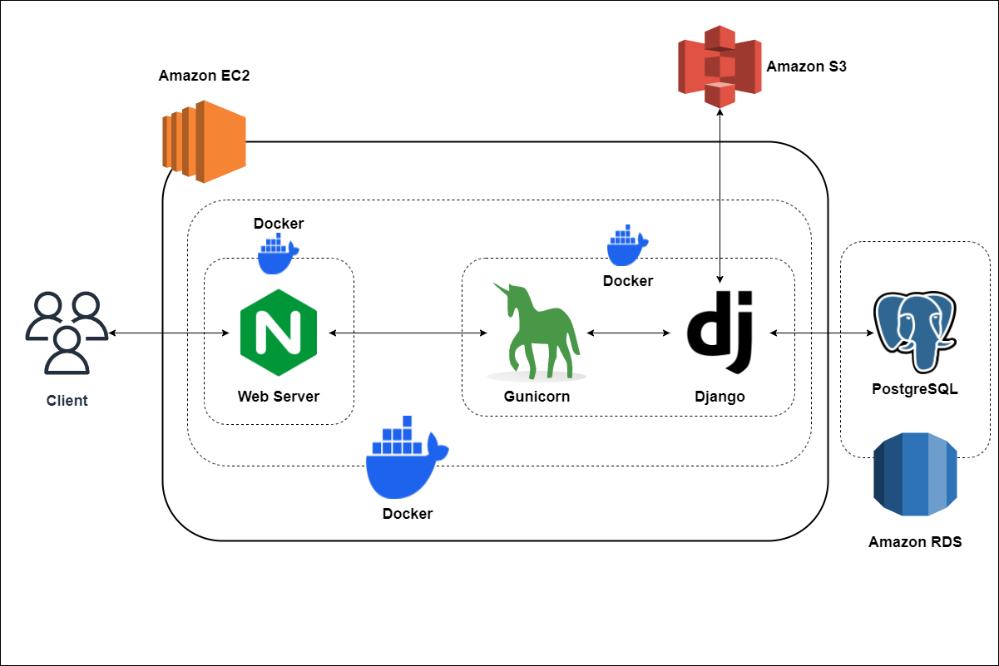
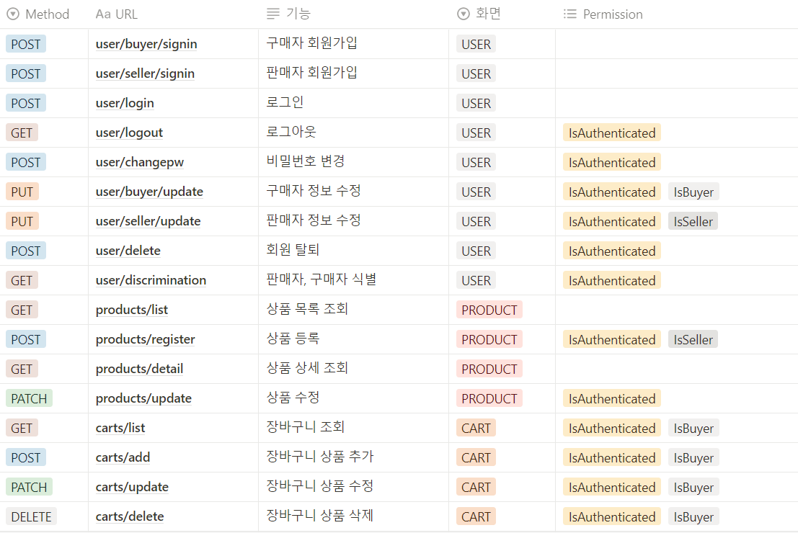
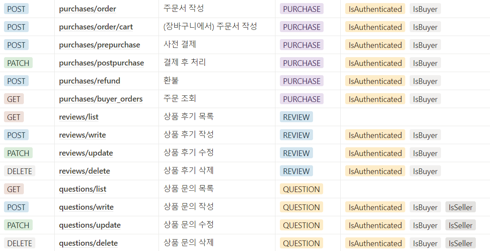

# MarketMate

## 1. 프로젝트 소개

### 1-1. 개요
- 마켓메이트는 누구나 편리하게 이용할 수 있는 e-commerce를 목표로 하는 서비스입니다.
- 기존 e-commerce 이용자가 친숙하게 이용할 수 있는 서비스입니다.

### 1-2. 기능 소개
- 사용자 관련 기능
    - 사용자는 구매자와 판매자로 구분되며, 회원 가입 시점에 정할 수 있습니다.
    - 각 회원 유형은 자신의 역할만 수행할 수 있으며, 회원 가입 이후에는 변경할 수 없습니다.
    - 회원 가입, 로그인, 로그아웃, 회원 정보 수정, 회원 탈퇴가 가능합니다.
    - 로그인은 Django REST framework에서 제공하는 토큰 인증 기능을 활용하고 있습니다.
- 상품 관련 기능
    - 모든 상품은 판매자와 구매자 모두 목록과 상세 보기 형식으로 조회할 수 있습니다.
    - 판매자의 경우 자신이 판매할 상품을 등록, 수정, 삭제할 수 있습니다.
    - 구매자의 경우 구매하고자 하는 상품을 바로 구매하거나, 장바구니에 담는 등의 행동을 할 수 있습니다.
- 문의 관련 기능
    - 구매자는 구매하고자 하는 상품에 문의를 작성, 수정, 삭제할 수 있습니다.
    - 이에 대해 판매자는 답변을 작성할 수 있으며, 한 개의 문의는 한 개의 답변을 갖습니다.
- 후기 관련 기능
    - 구매자는 기 구매한 상품에 대해 후기를 작성, 수정, 삭제할 수 있습니다.
- 장바구니 관련 기능
    - 구매자는 상품을 바로 구매하는 대신 장바구니에 담을 수 있습니다.
    - 장바구니에 담을 시 구매하고자 하는 수량을 정해 담을 수 있습니다.
    - 이미 장바구니에 담은 상품일 경우, 같은 이름의 새 상품을 장바구니에 담는 대신 기존 물품의 갯수를 증가시킵니다.
    - 장바구니에 담은 상품은 수량을 증감하거나 삭제할 수 있습니다.
- 구매 관련 기능
    - 상품의 상세 페이지에서, 상품을 바로 구매할 경우, 해당 상품에 대한 주문서를 만들고 정말 구매할 것인지 여부를 확인합니다.
    - 주문서 페이지에서 구매를 선택하게 되면 API를 통해 실제 구매로 넘어가게 됩니다.
    - 이 때, API에서 제공하는 사전 결제 정보 등록 기능을 활용하여 주문서와 실제 결제될 내용에 대한 검증하게 됩니다.
    - 또한 상품의 재고와 현재 구매하려는 수량을 비교하여, 상품의 재고가 부족할 경우 결제를 중단시킵니다.
    - 결제가 성공적으로 완료되면 결제 테이블을 관련 정보들로 수정합니다.

### 1-3. 프로젝트 참여 인원 및 역할 분담
- 이광호: 팀장, 전체 기능 총괄, S3 이미지 처리
- 성낙훈: 인증, 인가, 전체 기능 총괄, 결제 기능 개발
- 김태은: 상품, 문의, 후기 기능 개발, 문서 작성
- 전정헌: 장바구니, 결제 기능 개발, 문서 작성, 배포

### 1-4. 프로젝트 수행 기간
- 2023년 08월 17일 ~ 2023년 09월 04일(2주)


## 2. 기술 스택 및 배포 URL

### 2-1. 기술 스택
- 사용 언어

    

- 웹 프레임워크

    

- 형상 관리

    

- 배포

    
    
    

    

### 2-2. 배포 URL
- 프론트엔드: https://front.marketmate.digital/
- 백엔드(API 서버): https://www.marketmate.digital/

### 2-3. 테스트 계정
```
구매자 계정: buyer1@email.com / qwerty123!@#
판매자 계정: seller1@email.com / qwerty123!@#
```

## 3. 프로젝트 구조, 아키텍처 구성도, API 명세서, 데이터베이스 모델링

### 3-1. 프로젝트 구조
```
📦MarketMate
 ┣ 📂carts
 ┃ ┣ 📂migrations
 ┃ ┃ ┗ ...
 ┃ ┣ 📜admin.py
 ┃ ┣ 📜apps.py
 ┃ ┣ 📜models.py
 ┃ ┣ 📜permissions.py
 ┃ ┣ 📜serializers.py
 ┃ ┣ 📜tests.py
 ┃ ┣ 📜urls.py
 ┃ ┣ 📜views.py
 ┃ ┗ 📜__init__.py
 ┣ 📂main
 ┃ ┣ 📜asgi.py
 ┃ ┣ 📜env.py
 ┃ ┣ 📜settings.py
 ┃ ┣ 📜urls.py
 ┃ ┣ 📜wsgi.py
 ┃ ┗ 📜__init__.py
 ┣ 📂nginx
 ┃ ┣ 📜Dockerfile
 ┃ ┣ 📜marketmate.conf
 ┃ ┗ 📜nginx.conf
 ┣ 📂products
 ┃ ┣ 📂migrations
 ┃ ┃ ┗ ...
 ┃ ┣ 📜admin.py
 ┃ ┣ 📜apps.py
 ┃ ┣ 📜models.py
 ┃ ┣ 📜serializers.py
 ┃ ┣ 📜tests.py
 ┃ ┣ 📜urls.py
 ┃ ┣ 📜views.py
 ┃ ┗ 📜__init__.py
 ┣ 📂purchases
 ┃ ┣ 📂migrations
 ┃ ┃ ┗ ...
 ┃ ┣ 📜admin.py
 ┃ ┣ 📜apps.py
 ┃ ┣ 📜models.py
 ┃ ┣ 📜serializers.py
 ┃ ┣ 📜tests.py
 ┃ ┣ 📜urls.py
 ┃ ┣ 📜views.py
 ┃ ┗ 📜__init__.py
 ┣ 📂questions
 ┃ ┣ 📂migrations
 ┃ ┃ ┗ ...
 ┃ ┣ 📜admin.py
 ┃ ┣ 📜apps.py
 ┃ ┣ 📜models.py
 ┃ ┣ 📜serializers.py
 ┃ ┣ 📜tests.py
 ┃ ┣ 📜urls.py
 ┃ ┣ 📜views.py
 ┃ ┗ 📜__init__.py
 ┣ 📂reviews
 ┃ ┣ 📂migrations
 ┃ ┃ ┣ 📂__pycache__
 ┃ ┃ ┗ ...
 ┃ ┣ 📜admin.py
 ┃ ┣ 📜apps.py
 ┃ ┣ 📜models.py
 ┃ ┣ 📜serializers.py
 ┃ ┣ 📜tests.py
 ┃ ┣ 📜urls.py
 ┃ ┣ 📜views.py
 ┃ ┗ 📜__init__.py
 ┣ 📂static
 ┃ ┣ 📂admin
 ┃ ┃ ┃ ┗ ...
 ┃ ┗ 📂rest_framework
 ┃ ┃ ┃ ┗ ...
 ┣ 📂users
 ┃ ┣ 📂migrations
 ┃ ┃ ┗ ...
 ┃ ┣ 📜admin.py
 ┃ ┣ 📜apps.py
 ┃ ┣ 📜models.py
 ┃ ┣ 📜permissions.py
 ┃ ┣ 📜serializers.py
 ┃ ┣ 📜tests.py
 ┃ ┣ 📜urls.py
 ┃ ┣ 📜views.py
 ┃ ┗ 📜__init__.py
 ┣ 📂utils
 ┃ ┗ 📜images.py
 ┣ 📜.env
 ┣ 📜.gitignore
 ┣ 📜docker-compose.yml
 ┣ 📜Dockerfile
 ┣ 📜manage.py
 ┣ 📜README.md
 ┗ 📜requirements.txt
```

### 3-2. 아키텍처 구성도


### 3-3. API 명세서



### 3-4. 데이터베이스 모델링
- ERDCloud를 사용한 DB 모델링


## 4. 상세 페이지 설명
- 메인 페이지
    - (비로그인시) 상품 목록, 로그인, 회원가입 메뉴를 사용할 수 있습니다.
.png)
    - (로그인시) 상품 목록, 로그아웃, 회원정보, 장바구니 메뉴를 사용할 수 있습니다.
.png)

- 회원가입
    - 회원가입시 구매자와 판매자를 구분합니다.
    - 구매자는 구매만, 판매자는 판매만 가능합니다.
    - 역할 변경은 불가합니다.


- 로그인
    - 이메일과 비밀번호로 로그인 할 수 있습니다.

    - 로그인 성공 시 토큰이 발급되며, 이후 이를 통해 인증을 시도하게 됩니다.
    - 현재 로그인은 일회성입니다. 따라서 세션 스토리지에 저장하여, 브라우저나 탭 종료시 휘발되는 것을 의도했습니다.


- 마이페이지
    - 구매자와 판매자의 마이페이지를 별도로 구성하였습니다.
    - (판매자) 판매 상품을 등록·조회·수정할 수 있습니다. 
    - (구매자) 주문 현황 조회, 주문 상품 환불을 할 수 있습니다.
    - (공통) 회원 정보 수정, 비밀번호 변경, 회원 탈퇴를 할 수 있습니다.


- 상품 등록 페이지
    - 구매자는 상품을 등록할 수 없습니다.
    - 판매자의 경우 카테고리, 상품명, 가격, 수량, 상품 설명, 상품 판매 상태 등을 설정하여 판매할 물품을 등록할 수 있습니다.
    - 대표 이미지는 1장, 상세 이미지는 여러 장을 등록할 수 있습니다.
    - 등록한 이미지는 S3 버킷에 저장되고, DB에는 경로가 저장됩니다.


- 등록된 상품 리스트
    - 판매자의 경우 자신이 등록한 모든 상품의 리스트를 확인할 수 있습니다.
    - 필요한 경우 상품 데이터를 수정할 수 있습니다.


- 상품 목록 페이지
    - 현재 등록된 모든 상품의 목록을 확인할 수 있습니다.
    - 검색창을 통해 검색하거나, 카테고리 버튼을 눌러 각 카테고리에 맞는 상품만 필터링 할 수 있습니다.


- 상품 상세 보기 페이지
    - 모든 사용자는 상품 목록에서 원하는 상품을 선택하여 상세 내용을 확인할 수 있습니다.
    - 상품명, 카테고리, 가격, 재고, 상품 설명, 판매 상태, 평점, 상품에 대한 문의, 상품에 대한 후기를 확인할 수 있습니다.


- 상품 문의 페이지
    - (구매자) 상품에 대해 문의할 내용을 입력한 후 등록할 수 있습니다.
    - 기 입력된 문의 내용을 수정, 삭제할 수 있습니다.
    - (판매자) 구매자가 등록한 문의 내용에 답변할 수 있습니다.
    - 기 입력된 답변 내용을 수정, 삭제할 수 있습니다.
    - 하나의 문의에 하나의 답변을 제공할 수 있습니다.


- 상품 후기 페이지
    - 해당 상품을 구매한 구매자만 평점과 상품 후기를 등록할 수 있습니다.
    - 기 입력된 평점과 상품 후기는 수정할 수 있습니다.


- 장바구니 페이지
    - 구매자는 상품 상세 보기 페이지에서 수량을 지정하고 해당 상품을 장바구니에 담을 수 있습니다.
    - 기존에 등록되어 있던 상품을 다시 장바구니에 등록할 시, 새 상품으로 등록되는 것이 아니라 기존의 물품을 수량만 변경합니다.
    - 장바구니에 등록된 상품의 수량을 변경할 수 있으며 삭제도 가능합니다.
    - 체크박스에 체크한 상품 전체를 구매할 수 있습니다.


- 주문 페이지
    - 상품 상세 보기 페이지와 장바구니 페이지에서 구매를 시도할 수 있습니다.
    - 각 페이지에서 구매 버튼을 클릭시, 데이터를 통해 한 개의 주문이 만들어지며 이를 바탕으로 결제가 이루어지게 됩니다.
    - 결제 수단을 선택할 수 있지만, 현재는 카드 결제만 선택할 수 있습니다.


- 결제 페이지
    - 주문 페이지에서 결제 버튼을 클릭시 실결제로 이행합니다.
    - 포트원 API에서 제공하는 사전 결제 등록 시스템을 활용하여 결제 내용을 사전 등록하고, 반환되는 데이터를 활용하여 하나의 결제 데이터를 생성합니다.
    - 이 때 물품의 재고와 주문하려는 물품 수량을 비교한 다음, 재고보다 주문 수량이 많을 경우 결제를 진행할 수 없습니다.
    - 결제가 성공적으로 완료되면 포트원 API에서 반환하는 데이터를 활용해 주문 데이터와 결제 데이터, 물품 수량 데이터를 업데이트합니다.


- 결제 내역 페이지
    - 구매자는 자신이 구매한 내역을 확인할 수 있습니다.
    - 해당 페이지에서 기 결제한 주문을 결제 취소할 수 있습니다.


## 5. 프로젝트 완료 후 감상
- 이광호: 
- 성낙훈: 
- 김태은: 
- 전정헌: 